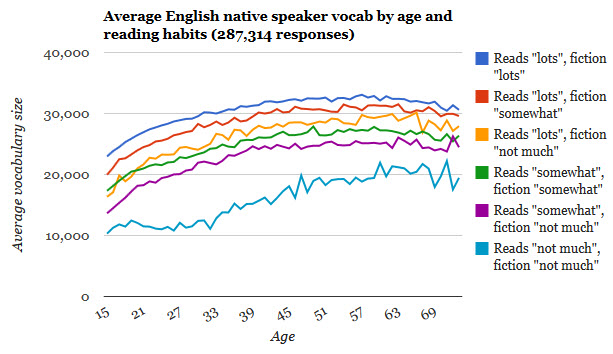

# Intro to Part 2

In part 2, we'll be downloading the model and trimming it to a reasonable size.

<!--more-->

Previous: [Part 1](/word-vector/2017-07-19-word-vector-pt-1) <br />
Next: [Part 3](/word-vector/2017-07-21-word-vector-pt-3)

# Downloading the model

Download GoogleNews-vectors-negative300.bin.gz from either
[code.google.com](https://code.google.com/archive/p/word2vec/) (requires a browser, ctrl-f negative300) 
or [this github archive](https://github.com/mmihaltz/word2vec-GoogleNews-vectors) (requires git-lfs).

Unzip the file with gzip.  It's quite large and in a binary format made for a python library called word2vec.  I'd
like to make the service in nodejs, so let's convert it to text.  We can use a program called [convertvec](https://github.com/marekrei/convertvec) to do this. An actual command list looks something like:

```
$ git clone git@github.com:marekrei/convertvec.git
$ cd convertvec
$ make
$ cp convertvec ../cv
$ cd ..
$ chmod +x cv
$ ./cv bin2txt GoogleNews-vectors-negative300.bin GoogleNews-vectors-negative300.txt
$ rm -rf convertvec
```

Now you should have `GoogleNews-vectors-negative300.txt`.  It's huge - 8 gigs - and contains 3 million lines (words). 
The format looks like this:
```
in 0.070312 0.086914 0.087891 0.062500 0.069336 -0.108887 -0.081543 -0.154297 0.020752 0.131836 -0.113770 -0.037354 0.069336 0.078125 -0.103027 -0.097656 0.044189 0.102539 -0.060791 -0.036133 -0.045410 0.047363 -0.120605 -0.063965 0.002258 0.037109 -0.002914 0.117676 0.061768 0.063965 0.081055 -0.068848 -0.021362 0.055176 -0.085449 0.068848 -0.127930 -0.033203 0.098633 0.175781 0.110840 -0.034668 -0.047119 -0.008484 0.035889 0.103027 0.026978 -0.028687 -0.005127 0.106445 0.059814 0.094238 0.033691 -0.027100 -0.094238 0.001030 -0.048340 0.034424 0.081055 -0.113281 -0.088867 0.035889 -0.145508 -0.244141 -0.061523 0.052979 0.056885 0.179688 0.061035 0.086914 0.124023 -0.040283 0.022583 0.177734 -0.029663 -0.029663 0.117188 0.031128 -0.096191 0.066406 0.004700 -0.080078 0.062988 -0.020630 -0.054688 -0.135742 -0.063477 0.083496 -0.063965 0.021484 0.077148 -0.037109 -0.033691 -0.183594 -0.072754 0.015869 0.093262 -0.061523 -0.014221 -0.003448 0.011108 -0.158203 -0.017090 0.006195 -0.008728 -0.080566 -0.015259 -0.087891 0.003479 -0.016113 -0.012329 0.097656 -0.139648 -0.085938 -0.026855 0.053955 0.132812 0.112793 0.121094 0.085449 -0.007111 0.044678 -0.145508 -0.003204 -0.117676 -0.065430 0.071289 -0.094238 -0.030273 0.120117 0.080078 -0.094727 -0.162109 -0.077637 0.021240 -0.081543 0.003937 -0.157227 -0.098145 0.039795 0.039307 -0.009094 0.103027 0.067871 -0.042725 0.063477 -0.049072 0.020874 -0.166992 0.093262 0.093750 0.006866 0.053711 0.052490 -0.024414 -0.032471 -0.061523 -0.005554 0.096191 0.037842 0.012207 -0.043945 -0.007477 0.105469 0.020386 0.145508 0.082031 0.005768 0.004578 -0.092773 -0.138672 -0.057373 -0.051514 -0.130859 -0.139648 -0.020508 -0.027100 0.032715 0.104980 -0.002335 -0.022583 0.000504 -0.110840 0.084961 -0.129883 -0.017456 -0.000359 0.107910 0.088867 0.044678 0.025146 0.023804 0.081055 0.023682 -0.109863 0.005371 -0.017700 -0.033936 -0.032959 -0.164062 0.095703 -0.018311 0.005310 -0.034424 -0.044189 -0.066406 -0.017944 -0.029663 -0.007599 -0.051270 -0.054199 0.089355 -0.071777 0.015259 -0.082520 -0.031738 0.035645 -0.021240 -0.059326 -0.013062 0.046875 0.023071 0.020996 -0.078613 -0.008057 0.019531 -0.005554 0.041504 0.027832 0.013611 0.034668 -0.182617 0.120117 0.074219 -0.041016 -0.009949 0.042969 -0.007294 0.123047 0.057617 -0.053467 -0.032227 -0.009094 -0.046631 0.043945 -0.050781 0.068848 0.002991 -0.004181 -0.044189 0.073730 -0.012756 0.067383 0.006287 0.075195 -0.037842 0.004883 0.044678 -0.067383 0.009705 0.004730 0.020508 0.071289 0.170898 0.173828 0.055664 0.091309 -0.037354 0.049805 -0.039307 0.044189 0.062500 0.048584 -0.053223 0.048828 -0.130859 -0.028931 -0.036133 -0.060791 -0.057373 0.123047 -0.082520 -0.011902 0.125000 0.001358 0.063965 -0.106445 -0.143555 -0.042236 0.024048 -0.168945 -0.088867 -0.080566 0.064941 0.061279 -0.047363 -0.058838 -0.047607 0.014465 -0.062500 
```

I'd like to make a simple service that has a smallish resource footprint, so let's not load the whole thing.  
The words at sorted by popularity.  At the top of the file we have `</s>`, `in`, `for`, and `that`;
at the bottom, we have `Mezze_Cafe`, `pulverizes_boulders`, and `snowcapped_Caucasus`.

Some things to notice:  The model uses capital letters sometimes, it contains compound phrases separated by
underscores, and there are some special codes.  Our implementation will only look up single words for simplicity, but 
we need to make sure to take care of capitalization:  the user could type `monday` but the model only contains `Monday`.

# Trimming the model

So let's cut off a section of the top of the file and convert it to a javascript object.  I wrote a quick 
ruby program to do this (it won't win any awards!):

```ruby
#!env ruby
require 'json'

input_array = ARGV
if input_array.length < 1
  puts "#{$0}: How many words should I include in the model?"
  puts "Use \"./#{$0} 10000\" to make a 10,000 word model."
  exit
end

limit = ARGV.shift
if !(limit =~ /\A\d+\Z/)
  puts "#{$0}: Please provide a limit in numbers."
  puts "Use \"./#{$0} 10000\" to make a 10,000 word model."
  exit
end
limit = limit.to_i

puts "module.exports = {"
words_seen = {}
output_index = 0
File.open("./GoogleNews-vectors-negative300.txt", "r") do |file|
  file.each_with_index do |line, input_index|

    next if input_index == 0
    line_array = line.split
    word = line_array.shift.downcase

    next if words_seen.key?(word)
    words_seen[word] = 1

    vectorPart = line_array.join(", ")

    puts "#{JSON.generate(word)}: [#{vectorPart}],"
    output_index += 1
    break if output_index >= limit
  end
end
puts "};"
```

Use it like so: `$ ./make_model.rb 25000 > ../words25k.js`

A 25k word model is about 75 megabytes, and includes a reasonable number of words.  Here's a graph showing
estimated vocabulary size for English native speakers from [testyourvocab.com](http://testyourvocab.com/):



# Up next

In part 3, we'll be using some basic linear algebra to find related words.

Previous: [Part 1](/word-vector/2017-07-19-word-vector-pt-1) <br />
Next: [Part 3](/word-vector/2017-07-21-word-vector-pt-3)
