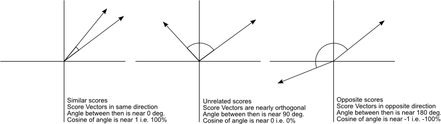
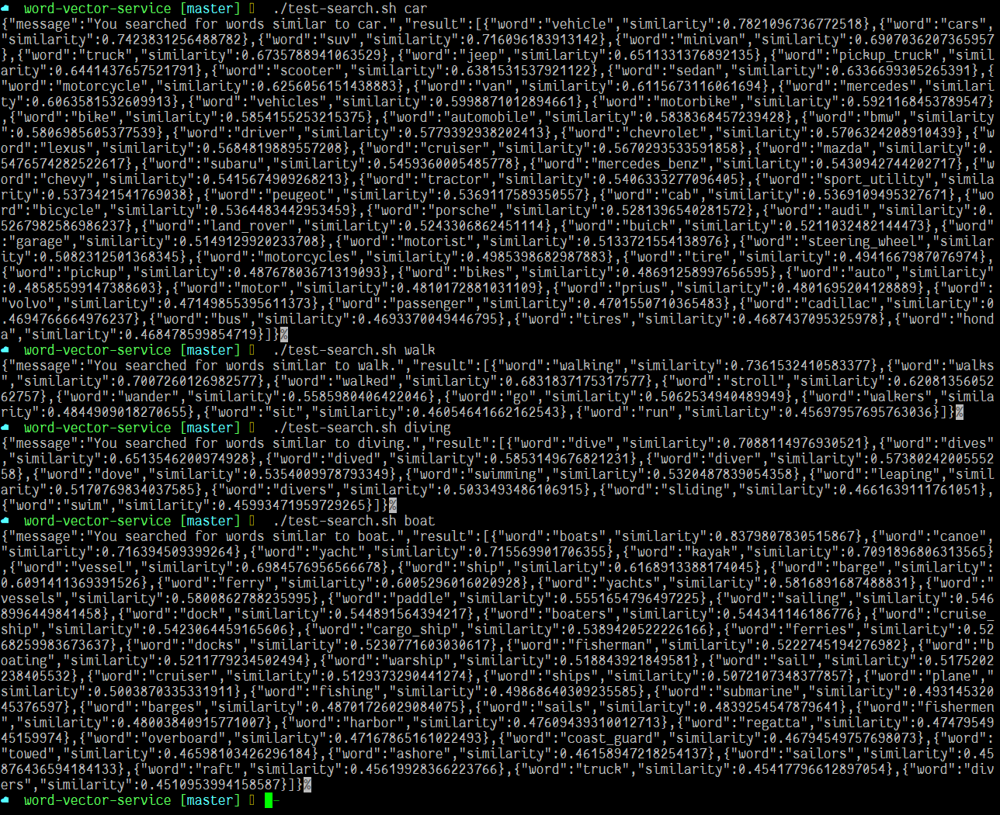

# Intro to Part 3

In part 3, we'll be using our new javascript word vector model to create a service that
lists words similar to an input word.

# Finding similar words

If we're given a word, we want to find words similar to it.  How do we do that?  The most
fundamental measure of distance is the [euclidean distance](https://en.wikipedia.org/wiki/Euclidean_distance), however; it's not used often in
machine learning applications.   What makes sense to our intuitions tuned for 2d and 3d spaces
might not work in a 300d space (see: [1](http://citeseerx.ist.psu.edu/viewdoc/download?doi=10.1.1.23.7409&rep=rep1&type=pdf) [2](https://stats.stackexchange.com/questions/99171/why-is-euclidean-distance-not-a-good-metric-in-high-dimensions) [3](http://www.overcomingbias.com/2017/07/high-dimensional-societes.html) [4](http://onlinelibrary.wiley.com/doi/10.1002/sam.11161/abstract)).

Instead, we can use [cosine similarity](https://en.wikipedia.org/wiki/Cosine_similarity), which will tell us if vectors are roughly pointing in the same direction or not:



# Calculating cosine similarity (theory)

This dot product formula contains the cosine of the angle between two vectors:

$\mathbf{a} \cdot \mathbf{b} = \|\| \mathbf{a} \|\|\_2 \|\| \mathbf{b} \|\|\_2 \cos \theta$

Solving for $\cos \theta$, we find:

$\cos \theta = \frac{\mathbf{a} \cdot \mathbf{b}}{ 
   \|\| \mathbf{a} \|\|\_2 \|\| \mathbf{b} \|\|\_2 
}$

The dot product can also be expressed as the sum of the products of the components of each vector, or:

$ \mathbf{a} \cdot \mathbf{b} = a\_1 b\_1 + a\_2 b\_2 + a\_3 b\_3 + \cdots + a\_n b\_n $

As a refresher,  $ \|\| \mathbf{a} \|\|\_2 $ is known as the L2 norm, or euclidean norm, or magnitude of a vector.

$ \|\| \mathbf{a} \|\|\_2 := \sqrt{a\_1^2 + a\_2^2 + \cdots + a\_n^2} $

A neat result is: $ \|\| \mathbf{a} \|\|\_2 := \sqrt{\mathbf{a} \cdot \mathbf{a}} $

# Calculating cosine similarity (practice)

Now that we know 

$\cos \theta = \frac{\mathbf{a} \cdot \mathbf{b}}{ 
   \|\| \mathbf{a} \|\|\_2 \|\| \mathbf{b} \|\|\_2 
}$

, let's write some javascript to calculate it.

My first stab at it was:

```javascript
const dotProduct = (a, b) => {
	if (!Array.isArray(a) || !Array.isArray(b) || a.length != b.length) {
		throw 'invalid arguments';
	}
	const zippedVectors  = a.map((x, idx) => [x, b[idx]]);
	const products = zippedVectors.map(x => x[0] * x[1]);
	return products.reduce((acc, x) => acc + x, 0);
}

const magnitude = a => Math.sqrt(dotProduct(a, a));

const cosineSimilarity = (a, b) => dotProduct(a, b) / (magnitude(a) * magnitude(b));
```

I default to writing psuedo-immutable + functional style.  However in this case, the function
turned out to be much slower than it needed to be.  I was able to get about a 10x speedup by
not calculating the `zippedVectors` and `products` intermediate arrays:

```javascript
const dotProduct = (a, b) => {
	if (!Array.isArray(a) || !Array.isArray(b) || a.length != b.length) {
		throw 'invalid arguments';
	}
	return a.reduce((acc, x, idx) => acc + (x * b[idx]), 0);
}

const magnitude = a => Math.sqrt(dotProduct(a, a));

const cosineSimilarity = (a, b) => dotProduct(a, b) / (magnitude(a) * magnitude(b));
```

Much better, even if the reduce is slightly awkward in my opinion.

# Almost done

Now I just need a quick function to use the `dotProduct` function to find me a list a similar words:

```javascript
export const findSimiliar = (word, threshold = 0.45, maxResults = 50) => {
	if (!(word in vectors)) { return []; }

	let results = [];
	for (let candidate of Object.keys(vectors)) {
		if (candidate == word) { continue; }

		const similarity = cosineSimilarity(vectors[word], vectors[candidate]);
		if (similarity < threshold) { continue; }

		results.push({word: candidate, similarity});
	}

	return results.sort((a, b) => b.similarity - a.similarity).slice(0, maxResults);
}
```

# Making an API

With these functions and the model, we have the guts of our API ready.  I used [Express & ES6 REST API Boilerplate
](https://github.com/developit/express-es6-rest-api) and wrote a little bit of glue code to make an API that takes 
an input word and lists similar words.  One important detail is I told babel not to transform my 75 megabyte model
file.  Here it is in action (w/ hard to read json):



[Gist of above](https://gist.github.com/mreishus/bfbb0a532f9ecdce536d80eb3e8897c1).

The code for this is on github: [Code](https://github.com/mreishus/vector-search-example/tree/03_added_vector_service).

# Up next

In part 4, we'll add the service to our react app.
